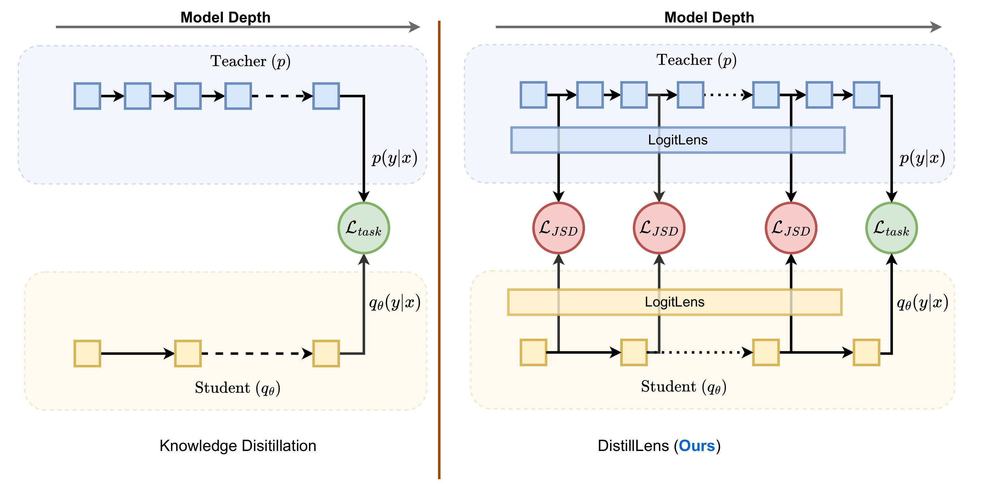
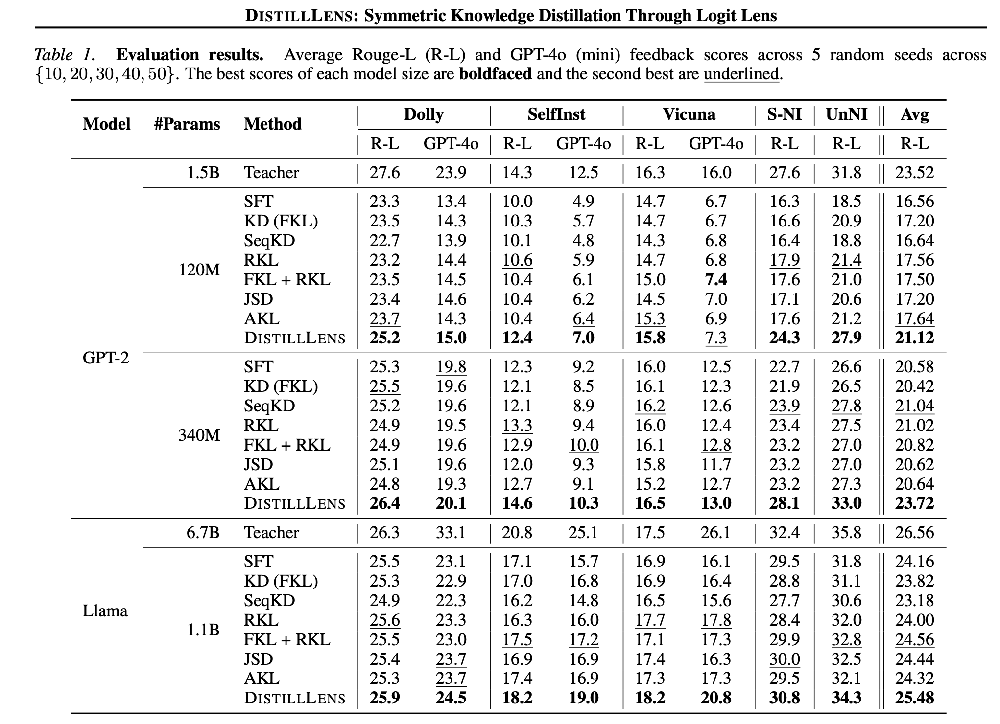

# DistillLens: Symmetric Knowledge Distillation Through Logit Lens

[](https://arxiv.org/abs/2602.13567)
[](https://huggingface.co/collections/manishdhakal/distilllens)

This is the official implementation of the paper **DistillLens: Symmetric Knowledge Distillation Through Logit Lens**.

---

## Abstract

> Standard Knowledge Distillation (KD) compresses Large Language Models (LLMs) by optimizing final outputs, yet it typically treats the teacher's intermediate layer's thought process as a black box. While feature-based distillation attempts to bridge this gap, existing methods (e.g., MSE and asymmetric KL divergence) ignore the rich uncertainty profiles required for the final output. In this paper, we introduce DistillLens, a framework that symmetrically aligns the evolving thought processes of student and teacher models. By projecting intermediate hidden states into the vocabulary space via the Logit Lens, we enforce structural alignment using a symmetric divergence objective. Our analysis proves that this constraint imposes a dual-sided penalty, preventing both overconfidence and underconfidence while preserving the high-entropy information conduits essential for final deduction. Extensive experiments on GPT-2 and Llama architectures demonstrate that DistillLens consistently outperforms standard KD and feature-transfer baselines on diverse instruction-following benchmarks.
---

## Environment Setup

To get started, clone the repository and set up the required environment:

```bash
pip3 install git+https://github.com/t1101675/transformers@minillm
pip3 install torch
pip3 install deepspeed
pip3 install numerize
pip3 install rouge-score
pip3 install torchtyping
pip3 install rich
pip3 install accelerate
pip3 install datasets
pip3 install peft
pip3 install wandb
```


## Method
<div style="text-align: center;">
  
</div>


## Checkpoints
Create a `checkpoints/` directory in the root of the proejct. Use Hugging-CLI to import the initial checkpoints:

```bash
#Student ckpts
huggingface-cli download gpt2 --repo-type model --local-dir checkpoints/gpt2-base
huggingface-cli download gpt2-medium --repo-type model --local-dir checkpoints/gpt2-medium
huggingface-cli download TinyLlama/TinyLlama-1.1B-intermediate-step-1431k-3T --repo-type model --local-dir checkpoints/TinyLlama-1.1B 

#Teacher ckpts
huggingface-cli download MiniLLM/teacher-gpt2-1.5B --repo-type model --local-dir checkpoints/teacher-gpt2-1.5B
huggingface-cli download MiniLLM/SFT-Llama-7B --repo-type model --local-dir checkpoints/SFT-Llama-7B 
```

## Data Setup
Follow <a href="https://github.com/microsoft/LMOps/tree/main/minillm#2-data">this link</a> for dataset setup. **Plain-text Corpus ($D_{PT}$) Setup** section from that link can be ignored; not needed for our runs.

## Training
### GPT2
From the `scripts/gpt2/distill_lens/train_all.sh` file, update the student model argument as needed:
```bash
model="base"  # "base" or "medium"
```

Run training with:
```bash
bash scripts/gpt2/distill_lens/train_all.sh
```

### TinyLlama
Run training with:
```bash
bash scripts/llama/distill_lens/train_all.sh
```

## Evaluation

### GPT2
From the `scripts/gpt2/eval/run_eval.sh` file, update the student model argument as needed:
```bash
CKPT_NAME="gpt2-base"   # "gpt2-base" or "gpt2-medium"
```

Run evaluation with:
```bash
bash scripts/gpt2/eval/run_eval.sh
```

### TinyLlama
Run evaluation with:
```bash
bash scripts/llama/eval/run_eval.sh
```


## Results
Our model achieves state-of-the-art performance on the multiple benchmarks.

<div style="text-align: center;">
  
</div>


## Citation
If you find our work useful in your research:
```
@article{dhakal2026distilllens,
  title={DistillLens: Symmetric Knowledge Distillation Through Logit Lens},
  author={Dhakal, Manish and Jinadu, Uthman and Budathoki, Anjila and Sunderraman, Rajshekhar and Ding, Yi},
  journal={arXiv preprint arXiv:2602.13567},
  year={2026}
}
```